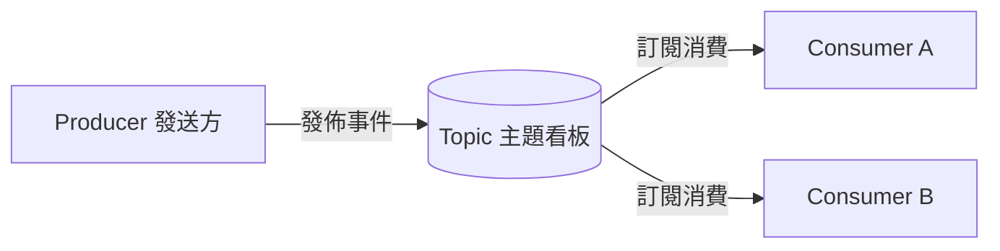
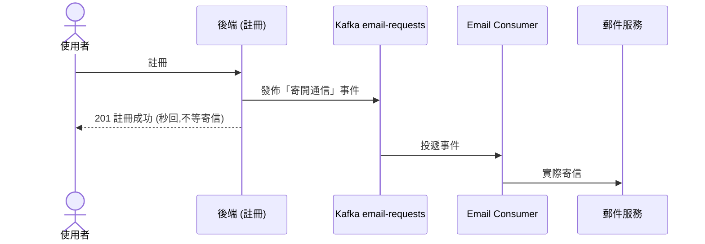
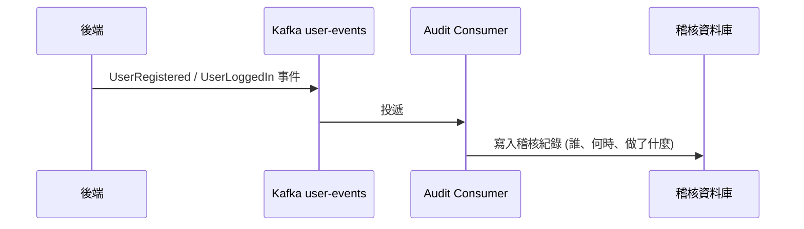
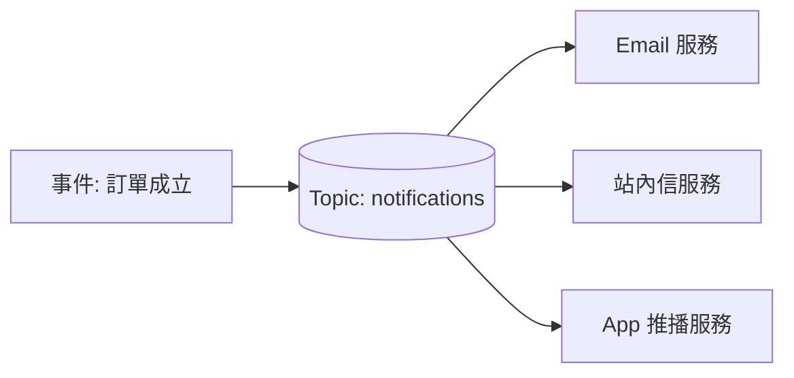
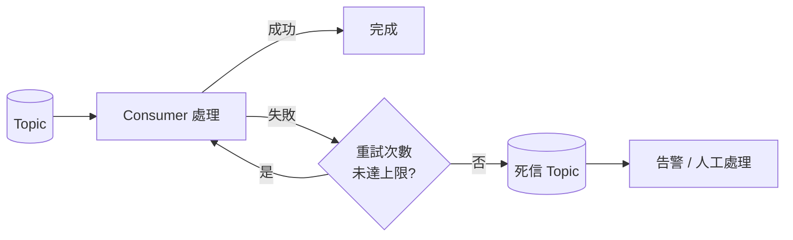
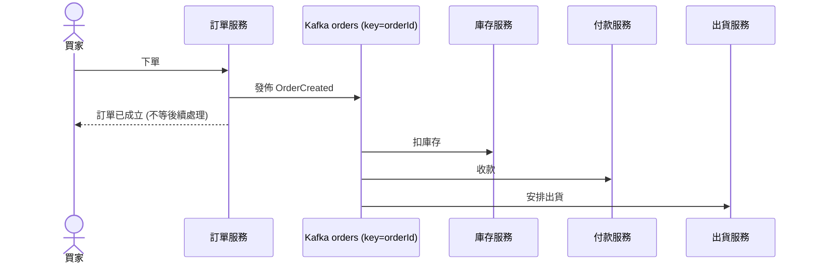
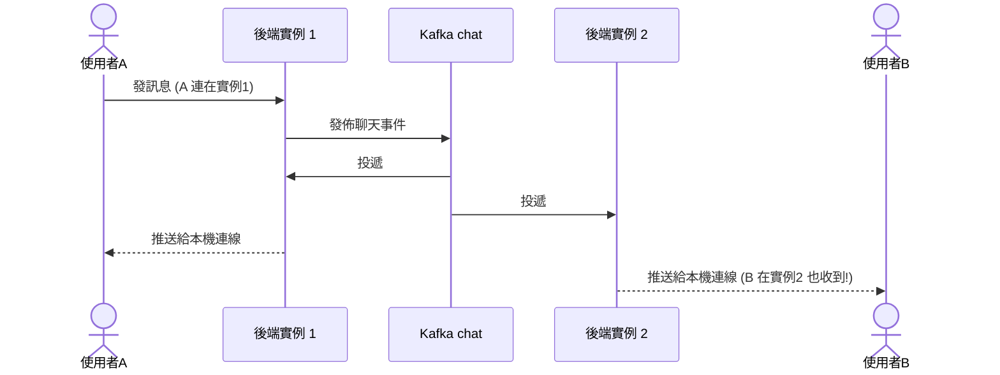
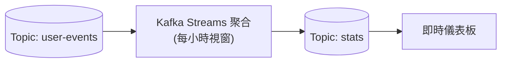
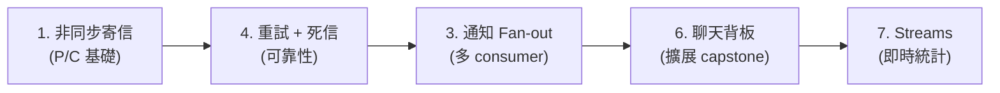

# Kafka 練習題目(事件驅動,由淺到深)

> 每題都附「給 PM 也看得懂的圖」+ 3~5 個真實應用案例。
> 核心精神:**非同步、解耦、可靠傳遞**——發送方不必等接收方,訊息會持久化、可重播。

---

## 先懂 Kafka(PM 版比喻)

Kafka 像一個 **「公告欄 + 郵局分流中心」**:發送方把訊息貼到某個「主題看板(Topic)」,訂閱該看板的接收方各自來拿。訊息會留存,接收方掛掉重開還能補拿。

| 名詞 | 白話 |
|---|---|
| **Producer** | 發送方(把事件貼上看板) |
| **Topic** | 主題看板(一類訊息,例如「寄信請求」) |
| **Consumer** | 接收方(訂閱看板、處理訊息) |
| **Consumer Group** | 一組分工的接收方(同組分攤訊息;不同組各自收一份) |
| **Partition** | 看板的分區(可平行處理;同 key 進同分區 → 保證順序) |
| **Offset** | 「讀到第幾則」的書籤(可回放重讀) |
| **DLT(Dead Letter Topic)** | 死信看板(處理一直失敗的訊息丟這裡隔離) |

---

## 1. 非同步寄信 ⭐⭐

**概念**:把「寄信」從主流程拆出去。註冊只負責「發一則寄信事件」就秒回,真正寄信交給背景的 consumer。

**為什麼好**:寄信慢或掛掉,不會拖累/失敗使用者註冊。

**應用案例**
1. 會員註冊開通信、密碼重設信
2. 訂單/付款確認信
3. 電子報、行銷 EDM 批量發送
4. 簡訊 / OTP 發送
5. 系統報表定期寄送

---

## 2. 事件稽核 Log ⭐⭐

**概念**:把重要行為當成「事件」發出,專門的 consumer 寫進稽核儲存,主流程零負擔。

**應用案例**
1. 登入軌跡 / 最後登入紀錄
2. 後台操作稽核(誰改了哪筆資料)
3. 金流交易流水帳
4. GDPR / 法遵的存取軌跡
5. 資安事件追蹤(異常登入)

---

## 3. 通知管線 Fan-out ⭐⭐⭐

**概念**:一個事件,**多個不同的 consumer group 各收一份**,各做各的(email、站內信、推播彼此獨立)。

**為什麼好**:要新增一種通知管道,只要加一個 consumer,**完全不動原本的程式**。

**應用案例**
1. 訂單成立 → 同時寄信 + 站內信 + 推播
2. 社群互動通知(按讚/留言/追蹤)
3. 系統告警 → Slack + Email + SMS 同步
4. 內容上架 → 通知所有訂閱者
5. IoT 設備警報多管道擴散

---

## 4. 失敗重試 + 死信佇列(DLT)⭐⭐⭐

**概念**:處理失敗時自動重試;重試 N 次仍失敗,就把訊息丟到「死信看板」隔離,不卡住後面的訊息。

**應用案例**
1. 寄信失敗自動重試(接題目 1)
2. 第三方 API 暫時掛掉 → 重試後成功
3. 付款 webhook 重送
4. 大量資料匯入,壞資料隔離不中斷整批
5. 訊息格式錯誤 → 進死信供工程師檢查

---

## 5. 訂單處理模擬(電商)⭐⭐⭐

**概念**:下單事件進 Kafka,**多個服務各自消費**(庫存、付款、出貨)。用 `key=orderId` 分區,保證同一筆訂單的事件有序。

**為什麼好**:搶購尖峰時,下單先「收進 Kafka」再慢慢處理(**削峰**),不會把資料庫打爆。

**應用案例**
1. 電商下單 / 搶購削峰
2. 外送平台派單(訂單→餐廳→外送員)
3. 票務搶票排隊
4. 銀行轉帳交易處理
5. 共享單車 / 叫車調度

---

## 6. WebSocket 聊天背板(跨實例)⭐⭐⭐⭐

**概念**:解決「多實例聊天收不到」的問題。訊息發到 Kafka,**每個實例都消費**,再推給自己手上的連線 → 不管使用者連在哪台都收得到。

**為什麼好**:這就是我們之前說的「in-memory 聊天無法水平擴展」的正解。

**應用案例**
1. 大型多人聊天室 / 客服系統
2. 即時協作(白板、共筆文件)
3. 多伺服器線上遊戲狀態同步
4. 即時看板 / 儀表板廣播
5. 線上拍賣出價即時同步

---

## 7. Kafka Streams 即時統計 ⭐⭐⭐⭐

**概念**:不只是傳遞訊息,還能在「資料流動的過程中」即時聚合運算(例如每分鐘/每小時的視窗統計),結果再輸出。

**應用案例**
1. 即時登入數 / 在線人數趨勢
2. 即時銷售額 / 熱銷排行
3. 詐騙偵測(短時間內大量交易)
4. 即時點擊熱度 / 內容熱榜
5. IoT 感測器即時均值 / 異常偵測

---

## 建議練習路徑

1. **先做 #1 非同步寄信**:最好的入門,而且直接改善現有 app(註冊不再被寄信拖累)。
2. 再加 **#4 重試/死信**(可靠性)。
3. 然後 **#3 fan-out**(多 consumer)。
4. 進階 capstone:**#6 聊天背板**(把 WebSocket 擴展難題解掉)。
5. 想玩串流再做 **#7 Streams**。

## 技術設定備忘

- **依賴**:`spring-kafka`(`KafkaTemplate` 發送、`@KafkaListener` 消費)。
- **本機跑 Kafka**:Docker 最簡單(新版 Kafka 用 KRaft 模式,單一容器即可,免裝 Zookeeper)。
- **雲端**:GCP 無原生 Kafka(對應品是 **Pub/Sub**);要真用 Kafka 可選 **Confluent Cloud 免費額度** 或 **Redpanda**。練習用本機 Docker 即可。

> 提醒:Kafka 需要一個 broker 在跑(不像 WebSocket 內建在 app 內),所以練習時要多開一個容器。
