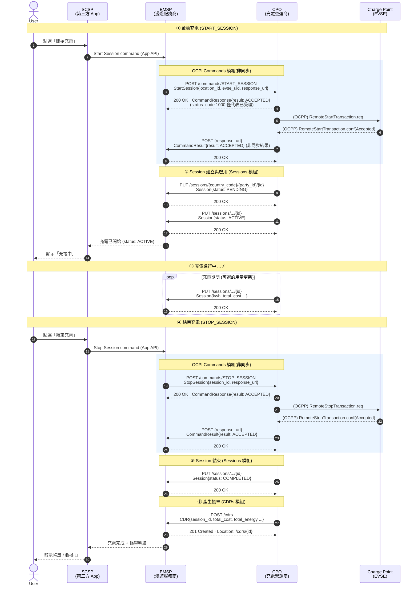

# OCPI 2.2.1 充電漫遊時序圖 (User → SCSP → EMSP → CPO)

> 以一次完整充電為例:啟動 → 充電中 → 結束 → 收到帳單 (CDR)。
> 依題目要求 **省略所有 Token / 認證流程**。
>
> 協定分層:
> - **SCSP ↔ EMSP**:EMSP 自家 App API(非 OCPI)
> - **EMSP ↔ CPO**:OCPI 2.2.1(Commands / Sessions / CDRs 模組)
> - **CPO ↔ Charge Point**:OCPP(此處僅以備註表示,非本題重點)

## 對應題目要求事件檢核

| 題目要求事件 | 圖中對應 | OCPI 依據 |
|---|---|---|
| SCSP → EMSP:Start Session command | 步驟 ① | App API |
| EMSP → CPO:CommandForward | `POST /commands/START_SESSION` | §13 Commands |
| CPO → EMSP:Session 更新 (PENDING → ACTIVE) | 步驟 ② 兩次 PUT | §9 Sessions |
| SCSP → EMSP:Stop Session command | 步驟 ④ | App API |
| EMSP → CPO:CommandForward | `POST /commands/STOP_SESSION` | §13 Commands |
| CPO → EMSP:Session 更新 (COMPLETED) | 步驟 ⑤ | §9 Sessions |
| CPO → EMSP:回傳 CDR | 步驟 ⑥ `POST /cdrs` | §10 CDRs |

## 設計重點(為何這樣畫)

1. **Commands 非同步雙回應**(§13.1):`CommandResponse` 只表示 CPO 已受理並會轉送充電樁;真正成敗由 CPO 之後 POST 到 eMSP 提供的 `response_url`,內容為 `CommandResult`。圖中刻意把這兩個回應分開畫。
2. **Session 由 CPO 推送**:eMSP 不是用輪詢,而是 CPO 主動 `PUT` 整個 Session 物件(Client Owned Object,URL 需含 `country_code` / `party_id` / `session_id`)。
3. **CDR 不可變更**:充電結束後 CPO 以 `POST /cdrs` 送出帳單,CDR 一旦送出即為最終帳務憑證。
