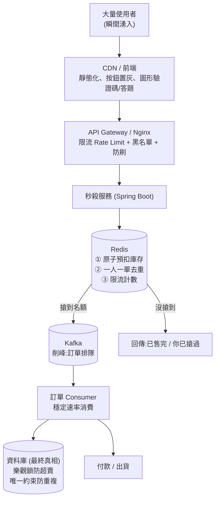
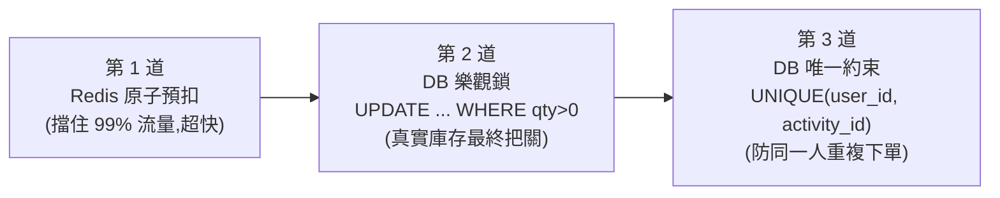
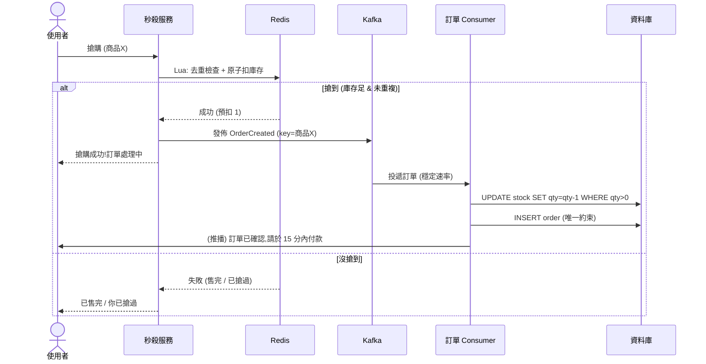

# 秒殺 / 搶購系統架構(搶票・稀缺顯卡・博弈搶單)

> 搶票、限量顯卡、博弈搶單 —— **本質是同一題**:
> 瞬間高並發 + 稀缺庫存 + **絕不能超賣** + 要公平有序。
> 核心分工:**限流擋人、Redis 扛速度與防超賣、Kafka 削峰、DB 最終把關**。

---

## 1. 問題的本質

| 挑戰 | 說明 |
|---|---|
| 瞬間高並發 | 10 萬人同一秒搶 100 張票 |
| 稀缺庫存 | 數量極少,大部分人會失敗 |
| **不能超賣** | 100 張就是 100 張,多賣一張就是事故 |
| 公平 / 防作弊 | 一人一單、防機器人、先到先得 |
| 不能拖垮系統 | 直接打 DB 會瞬間崩潰 |

**關鍵思維:把「擋人」放在越前面越好,真正能寫 DB 的請求要少到 DB 扛得住。**

---

## 2. 全景架構圖(分層,由上到下層層過濾)



**每一層只放行越來越少的流量:**
```
10萬請求 → 限流擋掉一半 → Redis 原子預扣擋掉 99%(只放 100 個搶到的)
        → Kafka 排隊 → Consumer 慢慢寫 DB(只剩 100 筆)→ DB 輕鬆
```

---

## 3. 各層職責

| 層 | 職責 | 為什麼放這裡 |
|---|---|---|
| **CDN / 前端** | 靜態頁、按鈕點一次就置灰、加驗證碼/答題拉長時間 | 把流量擋在最外層,順便防機器人 |
| **Gateway / Nginx** | 限流(每秒幾個請求)、IP 黑名單 | 廉價地擋掉暴力流量 |
| **Redis** | **原子預扣庫存 + 去重 + 限流** | **記憶體操作,單執行緒原子,每秒可扛十萬級** ← 防超賣第一線 |
| **Kafka** | **削峰**:搶到的訂單先排隊 | 後端用穩定速率消費,DB 不被瞬間打爆 |
| **DB** | 最終落地 + **最後一道防超賣** | 唯一可信真相,但最慢 → 放最後、流量最小 |

---

## 4. Redis 的職責(重點:為什麼不是 DB 扛第一線)

**核心:Redis 是「又快又能防超賣」的守門員。**

DB 一秒大概只能扛幾千次寫入;Redis 記憶體操作能扛**十萬級**,而且是**單執行緒、命令原子**,天生適合「高並發下安全地扣一個數字」。

Redis 在秒殺做三件事:

### ① 原子預扣庫存(防超賣的關鍵)
用一段 **Lua 腳本**(Redis 會原子執行,不會被插隊)一次做完「檢查+扣減+去重」:
```lua
-- KEYS[1]=庫存key  KEYS[2]=已搶名單key  ARGV[1]=userId
if redis.call('SISMEMBER', KEYS[2], ARGV[1]) == 1 then
  return -1          -- 你已經搶過了(去重)
end
local stock = tonumber(redis.call('GET', KEYS[1]))
if stock <= 0 then
  return 0           -- 已售完
end
redis.call('DECR', KEYS[1])          -- 扣庫存
redis.call('SADD', KEYS[2], ARGV[1]) -- 記下這人搶到了
return 1             -- 成功
```
> 因為整段腳本是**原子**的,一萬人同時跑,庫存也**絕不會被扣成負數** → 從源頭防超賣。

### ② 一人一單去重
上面的 `SISMEMBER` / `SADD` 就是去重:同一個 user 第二次來直接擋掉。

### ③ 限流 / 防刷
用 Redis 計數器限制「每人每秒幾次」「活動總 QPS」。

---

## 5. 避免超賣的設計:三道防線

**不要只靠一層!** 秒殺防超賣是「縱深防禦」:



### 第 1 道:Redis 原子預扣(速度)
擋掉絕大多數流量,確保進到後面的請求數量 ≈ 庫存數量。

### 第 2 道:DB 樂觀鎖(最終真相)
就算 Redis 和 DB 因故不同步,**DB 這句 SQL 也保證不超賣**:
```sql
UPDATE product
SET stock = stock - 1
WHERE id = ? AND stock > 0;   -- 只有 stock>0 才扣得動
-- 受影響列數 = 0 → 代表沒搶到,回滾這筆訂單
```
這叫**樂觀鎖**:不鎖整張表,靠 `WHERE stock > 0` 這個條件保證原子,**高並發下不超賣也不卡**。

### 第 3 道:唯一約束(防重複)
```sql
ALTER TABLE orders ADD CONSTRAINT uq UNIQUE (user_id, activity_id);
```
就算前面去重失效,DB 也會擋下同一人的第二筆 → 拋唯一鍵衝突。

---

## 6. 分散式鎖 vs 原子操作 vs DB 鎖(什麼時候用哪個)

| 方式 | 怎麼做 | 適合 | 不適合 |
|---|---|---|---|
| **Redis 原子操作 / Lua**(推薦) | `DECR` / Lua 腳本 | **扣庫存這種單一數字**,最快、無鎖競爭 | 多步驟複雜邏輯 |
| **分散式鎖**(Redisson `RLock`) | 跨實例搶同一把鎖,鎖住臨界區 | 需要「**序列化一段複雜操作**」(多筆資源一起改) | 純扣庫存(會把並發變串行,變慢) |
| **DB 樂觀鎖** | `UPDATE ... WHERE stock>0`(或版本號) | **最終落地把關**,寫入量小時 | 第一線高並發(DB 扛不住) |
| **DB 悲觀鎖** | `SELECT ... FOR UPDATE` | 強一致、低並發場景 | 高並發(鎖等待會雪崩) |

> **秒殺的黃金組合**:**Redis 原子預扣(扛並發)+ DB 樂觀鎖(保正確)**。
> **分散式鎖不是用來扣庫存的**(會把並發變串行);它用在「需要互斥執行一段複雜流程」時。這是面試常見誤區。

---

## 7. 一次「搶購」的完整時序



**收尾要處理的細節:**
- **未付款還原庫存**:搶到但 15 分鐘沒付款 → Redis 庫存 `INCR` 還原 + 取消訂單(用延遲訊息 / 定時掃描)。
- **Redis 與 DB 對帳**:活動結束後核對,Redis 是「快取的預扣」,DB 才是最終真相。

---

## 8. 我現在的專案 demo 得出來嗎?

**可以做一個縮小版 demo,但要補幾塊**(目前專案有 Spring Boot + Postgres,缺 Redis 和 Kafka):

| 需要 | 現況 | 要補 |
|---|---|---|
| Spring Boot 後端 | ✅ 有 | — |
| 資料庫(庫存/訂單表 + 樂觀鎖 SQL) | ✅ 有 DB | 加 `product`/`orders` 表 |
| **Redis**(原子預扣) | ❌ 沒有 | 加 Redis + Lua 腳本 |
| **Kafka**(削峰) | ❌ 沒有 | 加 Kafka(接 kafka-practice #5) |
| 壓測(模擬高並發) | — | 用 JMeter / k6 打它,觀察不超賣 |

**最小可 demo 版**(不需要 Kafka 也能展示防超賣):
```
搶購 API → Redis Lua 原子預扣 → 成功才寫 DB(樂觀鎖)
```
用壓測工具開 1000 並發搶 10 個庫存,**結果剛好賣出 10 個、不多不少** → 就證明了防超賣。再加 Kafka 展示削峰。

---

## 9. 怎麼跟人解說(一段話)

> 「秒殺的核心是**層層過濾 + 縱深防超賣**。前面用限流和前端把流量擋掉大半;真正的關鍵在 **Redis**:用 Lua 腳本**原子地扣庫存 + 去重**,因為 Redis 記憶體操作又快又原子,能在高並發下保證庫存不被扣成負數 —— 這是防超賣第一線。搶到的訂單丟進 **Kafka 削峰**,後端用穩定速率慢慢寫 DB,避免瞬間打爆資料庫。最後 **DB 用樂觀鎖(`WHERE stock>0`)和唯一約束**做最終把關,即使 Redis 與 DB 短暫不同步也絕不超賣。**分散式鎖不拿來扣庫存**(會變串行),它是用在需要互斥執行複雜流程的場景。」

| 角色 | 一句話職責 |
|---|---|
| **限流 / 前端** | 把人擋在外面 |
| **Redis** | 又快又原子地扣庫存 + 去重(防超賣第一線) |
| **Kafka** | 削峰,讓 DB 慢慢消化 |
| **DB(樂觀鎖 + 唯一約束)** | 最終真相,最後一道防超賣 |
| **分散式鎖** | 只在需要「互斥執行複雜流程」時用,不扣庫存 |
